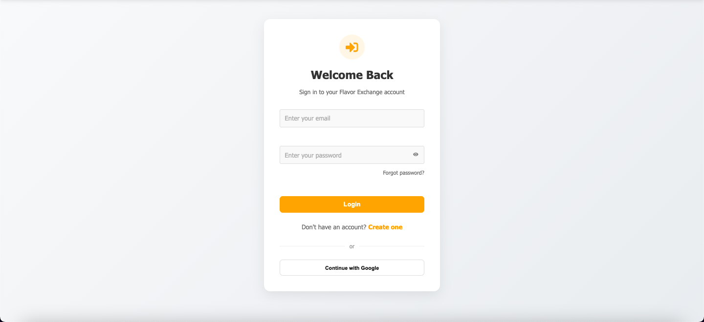
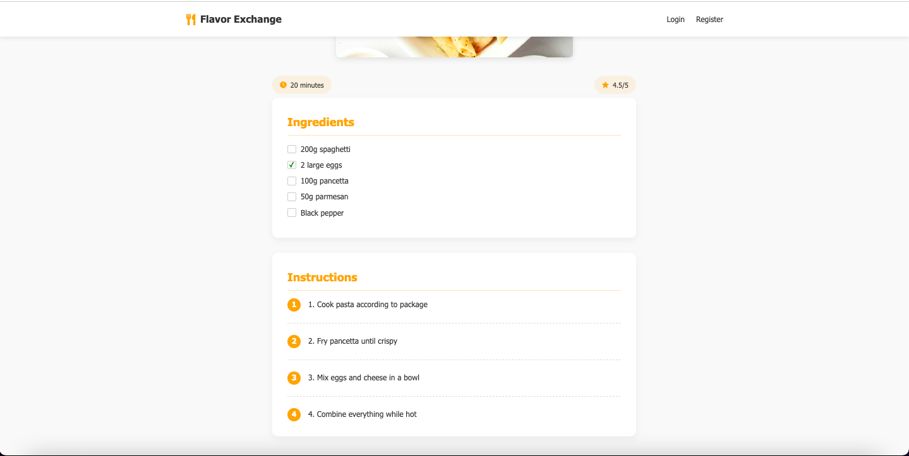

# 🍽️ Flavour Exchange

A simple and interactive recipe-sharing platform built with React and Vite. Users can browse, save, and share recipes using a mock backend.

---

# 🖼️ How Does it Look

---

## 🚀 Features

- 🔍 Recipe Feed with search filter
- 📖 Recipe Details page with full instructions
- ❤️ Save to Favorites functionality
- 🔐 Mock Login & Signup (stored in localStorage)
- ✏️ CRUD for recipes (Add / Edit / Delete)
- 🌐 React Router for client-side navigation
- ⚛️ State management with Zustand / Redux / Context
- 💅 Styled with Material-UI / CSS

---

## 🛠️ Tech Stack

- React
- Vite
- Zustand / Redux / Context API
- React Router
- CSS / MUI
- JSON Server (for mock API)

---
